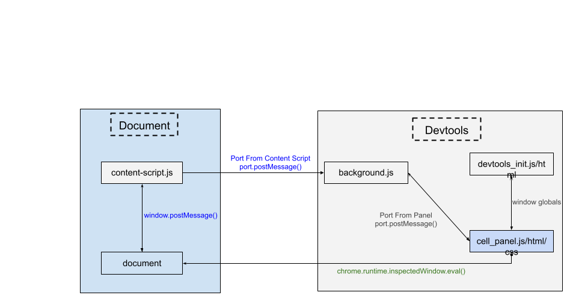

## Chrome Devtools Extensions ##

The code here is devoted to building devtool extensions and related development.

**NOTE: as of writing this is tested only in Chrome 106.X.**

### Installation ###

Open the extension manager in chrome. Then press "Load Temporary Add-on," select the [manifest.json](./manifest.json) file and press "open." When loading one of our example applications and opening devtools you should see a "Cells" panel. 

### Development ####

At its core the devtools extension is configured and defined by a [manifest.json](./manifest.json) file [NOTE: currently this is written for Manifest V2 which will no longer be supported in 2023]. The internals of the configuration is pretty self explanatory but the key thing to note is the presence of a `devtools_page` key. This specifies that the current is a "devtools extension" as opposed to a generic chrome extension.  You can read more about manifests [here](https://developer.mozilla.org/en-US/docs/Mozilla/Add-ons/WebExtensions/manifest.json). 

After loading the extension as above you can see your changes by pressing the `reload` button. You can also load a devtools for the devtools by pressing `Inspect`, but the functionalities are limited (for example there is no view on the DOM, since there is no DOM here in the standard sense).

The rest of the story consists of understanding all the necessary components and how these communicate. This is summarized in the image below: 

With the above "knowledge" you should already be able to guess that everything in the "Devtools" box will log to the devtool's devtool console, while everything in the "Document" box will log to the document's devtools console. 

Lets go through these one at a time:

[devtools_init.html](./devtools_init.js) and [devtools_init.js](./devtools_init.js)
-------------------------------------------------------------------

  With the extension loaded as above, when the devtools open it will load the `devools_page` specified in the manifest file. Even though [devtools.html](./devtools.html) is technically an html page, devtools pages **do  not** have any visible DOM or access to WebExtension API's. What they do have is JS source code included via the `script` tag. In our case this is the [devtools_init.js](./devtools_init.js) file. 
  
This bundled source file **does** have access to DOM API's through the global `window` object, same WebExtension API as content scripts (see below), and devtools APIs. The first thing this script does is use the latter to [create and configure the panel](./devtools_init.js#L9). Then subsequently it sets up global variables for holding data, callbacks for `panel.onShow` (fired for example when the panel icon is clicked) and `panel.onHidden`, as well as opening a `chrome.runtime.Port` which will allow for communication between the panel and the [background.js](./background.js) processes (see more on that below). 

Note: since `devtools_init.js` has access to the `window` object, which is the context that panel lives in, we can call functions or access variable between the two. 
For example, [window.handleMessageFromBackground()](./devtools_init.js#L25) is defined in [cell_panel.js](./js/cell_panel.js) but we can still access it through `_window`. 

Note also, the var `_window` is used here to deal with the possibility that at times the message inspector panel is closed (for example you are looking at console or something else) but there is still message passing going on and data needs to be stored. In this case the panel collects data which will be subsequently processed when the panel opens. This is the core of what is defined in the `devtools_init.js` file. 

[panels](./js)
------------------

The files you find in [js](./js) are what you expect of every normal web application: there is html, js and css. As of writing there are two interesting pieces here: 

* the `handleMessageFromBackground()` function, already seen above called in `devtools_init.js`, is the callback for a message coming in from [background.js](background.js) via the panel port connection set up in `devtools_init.js`. The function handles the incoming message and updates in the display in the panel accordingly. As of writing it cases on `msg.status` (initial load, reconnecting, loaded) and calls for corresponding display functions,
* Note the `mouseover` and `mouseleave` event handlers added to the tree in [tree.js](./js/tree.js). This callback uses the `chrome.devtools.inspectedWindow.eval` API to insert a raw script and execute it on the `document`, i.e. on the inspected window. This allows for a way to by-pass the "standard" extension communication protocol and directly interact with the target window, although in a somewhat limited way. Is it safe to call `eval()` on raw scripts strings - depends... so use with caution. 

In short, the code in panels is what you see when you click on the devtools message inspector icon and it communicates with the rest of the world either via `backround.js` or via direct script insertions. 

[background.js](./background.js)
--------------------------------

[background](background.js) is the bridge communication between the devtools panel and the target application (see more on this in the content-script description below). 

It
* listens for `chrome.runtime.Port` communications from both the `content-script.js` and the `cell_panel.js`,
* routes messages as needed via the various open ports. 

[content-script.js](./content-script.js)
----------------------------------------

This script is injected into the target document window and runs each time devtools is open, i.e. everything here is essentially the same as any js code that you import via the `script` tag into your application. The key exception is that **content scripts have access to the background script** defined processes and code via the `chrome.runtime.Port` API **and** it can communicate with the your application (in our case via the [window.postMessage()](https://developer.mozilla.org/en-US/docs/Web/API/Window/postMessage) API. 

Since devtools doesn't have direct access to the target window API, `background.js` becomes the bridge for all communication. 

Now it's pretty clear what content scripts should do:
* set up a port to communication with background,
* listen to messages coming via the `window.postMessage` interface and forward whatever is needed to background.

The messages that content script here is waiting on are sent in `System.sendMessage()` in our application. 

And that's more or less it. 
